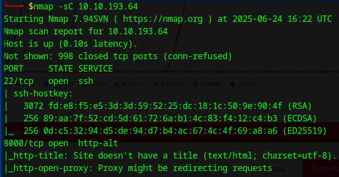
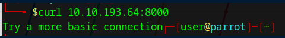
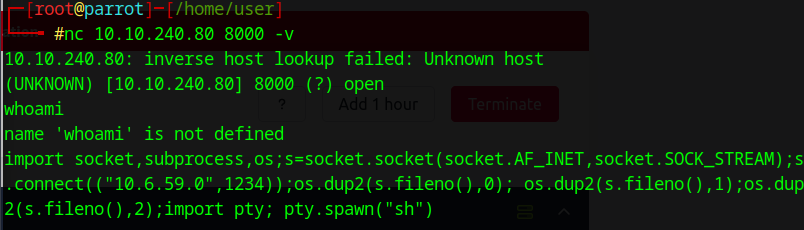
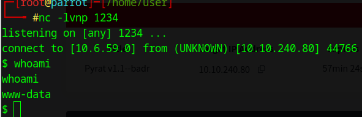
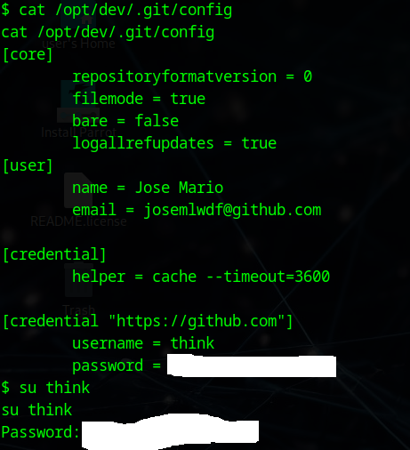
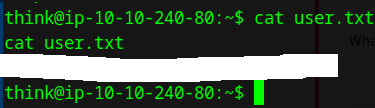

# TryHackMe “Pyrat” Walkthrough – First Practical Reverse Shell

## Overview  
The TryHackMe room Pyrat simulates a real-world exploitation scenario leveraging CVE-2021-28861 - a command injection vulnerability in the SimpleHTTPServer.py module from Python 2.7. This vulnerability allows remote command execution via unsanitized user input passed into the HTTP request.
In this walkthrough, I focused on:
- Setting up a listener on my attacking machine using netcat.
- Getting Shell to the remote target using the exposed HTTP service.
- Crafting and executing a Python-based reverse shell payload that exploited the vulnerable HTTP server.
The exploit allowed me to spawn a reverse shell from the target back to my local system, establishing a foothold as a low-privilege user. From there, I enumerated the file system to locate and capture the user.txt flag. This marked my first practical experience with reverse shell execution and initial access tactics within a CTF-style environment.
While I was able to complete initial exploitation and user flag retrieval, I reviewed the available escalation paths and decided to return to them later with a more methodical enumeration plan and a broader toolset.

## Recon & Initial Access

I began by scanning the target machine with Nmap using default scripts and version detection:

This revealed an open port 8000 running SimpleHTTP/0.6

(Note: I ran the command with -sV as it provided more info about the version)

To confirm the service, I used curl to connect directly to the target:

The response confirmed the presence of a live web server. Based on the challenge’s description, I attempted a simple connection:

Trying basic commands like whoami produced error, which hinted at limited or filtered execution. Since the backend was Python-based, I used a reverse shell payload in Python.
On my local machine, I set up a listener and Once triggered, the payload returned a reverse shell as user www-data.

While enumerating the system, I discovered a Git configuration file at:
/opt/dev/.git/config

Viewing its content exposed Git credentials—username "Think" and a password.

Using these credentials, I gained access to the Think user’s environment and retrieved the user.txt file:

## Privilege Escalation Attempt

With user-level access obtained, I explored initial steps toward root escalation. The challenge’s escalation path appeared to involve more advanced techniques beyond the scope of this session, so I focused this write-up on initial access and user flag capture. I’ll revisit the root path as part of future escalation-focused practice.

## Reflection & Takeaways

Working through the Pyrat box was a major step forward in applying the fundamentals I’ve been learning. Gaining a reverse shell, capturing the user flag, and understanding the vulnerability behind CVE-2021-28861 made exploitation feel real—not just theoretical.

A few key lessons I took from this session:
- Reverse shells aren’t intimidating once you understand what each part of the payload is doing.
- A clear network setup and consistent IP configuration matter more than I expected.
- Even if a challenge isn’t fully completed, progress made is still meaningful—especially when it comes with new tools, patterns, or clarity.

I’m viewing this as the first entry in what I hope will be a growing collection of walkthroughs, each one capturing how I explore, learn, and evolve.

